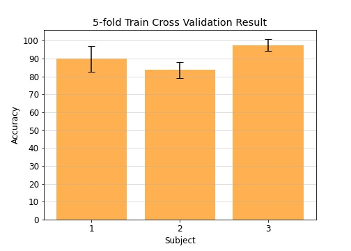
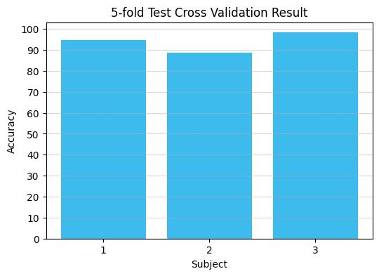

# BCICIV2a-FBCSP
This work is an implementation of filter-bank common spatial pattern (FBCSP)[1] on BCI Competition IV dataset 2a. 
While the dataset consist of four class, this work will only use two class which are left and right hand

# Result
Early result on train and test data, SVM model is used as classifier, 5-fold CV is used to evaluate model performance
## Train Score

## Test Score

## Train and Test Score
Subject| Train | Test
-------|-------|-----
1|89.92% +/- 7.21| 94.83 % |
2|83.56% +/- 4.42| 88.79 % |
3|97.42% +/- 3.37| 98.28 % |

**Note** : 
Test result looks suspiciously high, if you guys found something incorrect please open an issue.  
I only did for three subjects, but you can extend the result to all nine subjects, the data are there.

# Reference
[1] Kai Keng Ang, Zheng Yang Chin, Haihong Zhang and Cuntai Guan, "Filter Bank Common Spatial Pattern (FBCSP) in Brain-Computer Interface," 
2008 IEEE International Joint Conference on Neural Networks (IEEE World Congress on Computational Intelligence), Hong Kong, 2008, pp. 2390-2397, doi: 10.1109/IJCNN.2008.4634130.  
[2] Ang, K. K., Chin, Z. Y., Wang, C., Guan, C., & Zhang, H. (2012). Filter Bank Common Spatial Pattern Algorithm on BCI Competition IV Datasets 2a and 2b. 
Frontiers in Neuroscience, 6. doi: 10.3389/fnins.2012.00039

# Milestone
2020.11.02 - Train/test result without hp tuning  
2024.01.04 - Just general maintenance, fix some stuff, add requirements, dockerfile, devcontainer

# Datasets
I included the datasets, which was originally here https://github.com/bregydoc/bcidatasetIV2a  
The datasets is IV2a, the description is here https://www.bbci.de/competition/iv/desc_2a.pdf  
This is link to BCI Competition IV https://www.bbci.de/competition/iv/ which contains above page

# Note
Future updates (probably...):
- Evaluate on all 9 subjects
- Tune hyperparameters
